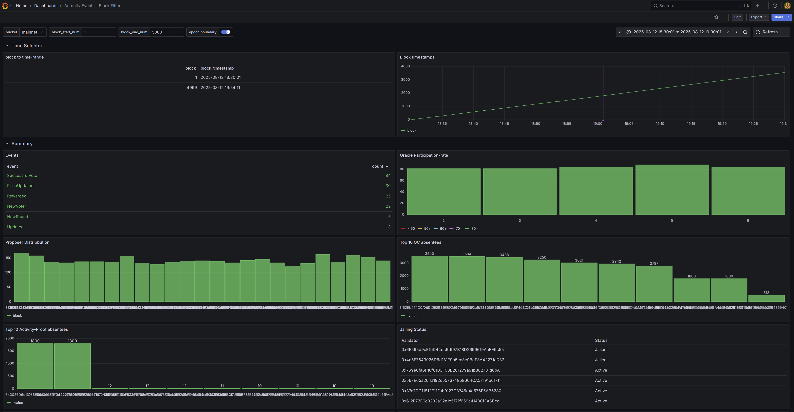

# Seer

**Seer** is a monitoring tool designed to capture autonity on-chain events, 
It decodes and stores them in InfluxDB, Events are visualized later on Grafana.


---

## Getting Started

### Prerequisites

- **Go** (version 1.21 or higher)
- RPC url to an Autonity node

### Installation

1. Clone the repository:
   ```bash
   git clone https://github.com/autonity/seer.git
   cd seer
   ```

2. setup a new influxdb token in .env file and prepare configuration:
   ```bash
   make init
   ```

3. Run application in default mode:
   ```bash
   make run
   ```
---

### Reset InfluxDB data and re-initialize
1. Reset influx DB token, this overwrites the existing influxdb token, (take backup if required)
   ```bash
   make reset-token
   ```
2. Reset volumes to removes influxdb data
   ```bash
   make reset
   ```
3. Run application in default mode:
   ```bash
   make run
   ```

## Visualize
Go over to ```localhost:3000``` to visualize the data captured by Seer.


## Configuration

Seer uses **Viper** for configuration management. You can specify options via:
- A `config.yaml` file.
- Environment variables.
- Command-line flags.

### Sample `config.yaml`:
```yaml
seer:
   logLevel: "info"
node:
   rpc:
      maxConnections: 25  # maximum rpc connections across all urls
      urls:
         - <RPC_URL> # e.g. "http://localhost.8545" - should be an archive node for historical sync
   ws:
      maxConnections: 5 # maximum websocket connections across all urls
      urls:
         - <WS_URL> # e.g. "ws://localhost:8546" - should be an archive node for historical sync
   sync:
      history: true 
db:
   url: "http://127.0.0.1:8086"
   token: ""
   bucket: "mainnet"
   org: "autonity"
abi:
   dir: "../abis"
```
---

## Usage

### CLI Commands

1. **Start service in default mode which syncs live and historical blocks**:
   ```bash
   ./seer start --config ../config/config.yaml
   ```

2. **Start service in pull mode where only given range of blocks are synced**:
   ```bash
   ./seer pull --start-block=1000 --end-block=20000 --config ../config/config.yaml
   ```

3. **Check Version**:
   ```bash
   ./seer version
   ```

## Development

### Running Tests

Run tests for all modules:
```bash
make test
```

### Linting and Formatting

Format and lint the codebase:
```bash
make fmt
make lint
```

---

## Contributing

Contributions are welcome! Please submit a pull request or open an issue if you find a bug or have a feature request.

---

## License

This project is licensed under the MIT License. See the `LICENSE` file for details.

---
